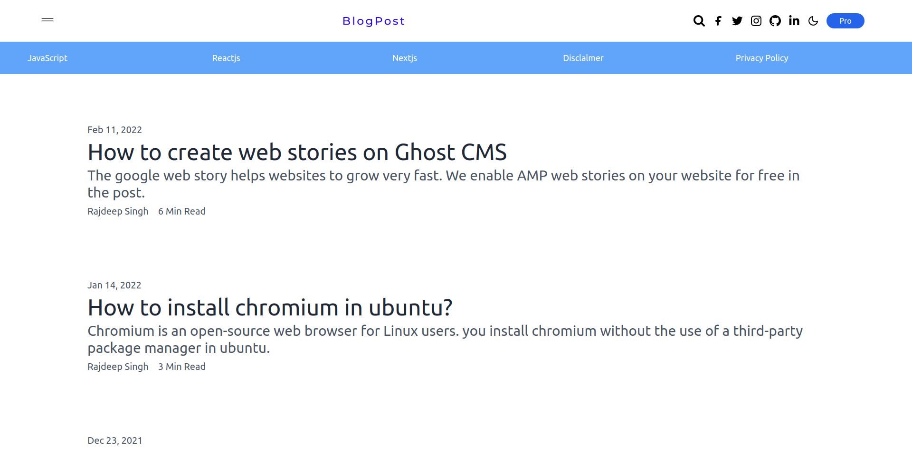

# Tailwind CSS Playground
Blogpost is simple lightweight html template for blog. you can start blogpost template. we use `live-server`, `tailwindcss`,`postcss` and `postcss-cli` npm package in blogpost.

## DEMO



To get started:

1. Clone the repository:

   ```bash
   git clone hhttps://github.com/officialrajdeepsingh/blogpost

   cd blogpost
   
   ```

2. Install the dependencies:

   ```bash
   # Using npm
   npm install

   # Using Yarn
   yarn install
   ```

3. Start the development server:

   ```bash
   # Using npm
   npm run dev

   # Using Yarn
   yarn dev
   ```

   Now you should be able to see the project running at localhost:8080 in your browser.

4. Open `public/index.html` in your editor and start experimenting!

## Build the CSS production file
You can build the CSS production file using `npm run buid` command.

```bash
# Using npm
npm run build

# Using Yarn
yarn build

```
## Start local server 
you can start local server using ` npm run start ` command.


## Images
All the image collect on pixbay and unsplash.